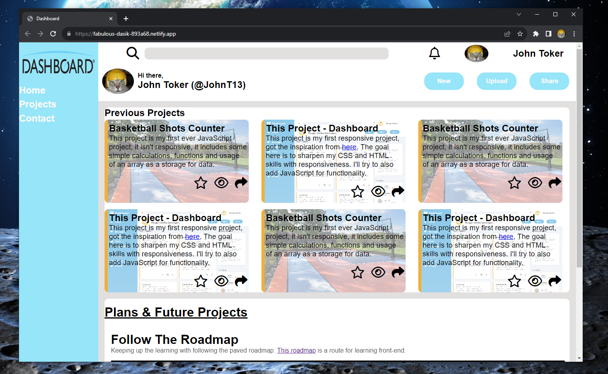

# First-Responsive-Project---Dashboard
My first designed responsive web page. Edit: after 2 months of learning this website looks poorly designed but still for a first time responsive website - not bad.
Here is a link for the website:
https://fabulous-dasik-893a68.netlify.app/
How it looks like:

